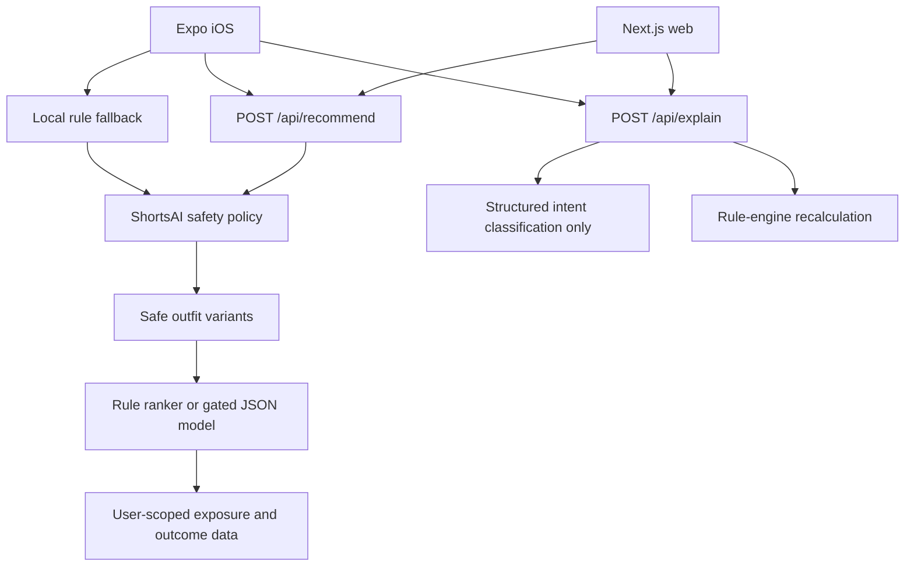

# ShortsAI

ShortsAI is a weather-aware outfit planner for runners, walkers, and commuters. It combines the start, finish, and return forecast with activity load and context-specific comfort memory, then presents up to three safe choices: lighter, standard, and warmer.

The permanent product boundary is simple: ShortsAI rules enforce safety, a learned model may rank only safe candidates, and AI may classify a request or explain a recalculated result. Neither AI nor the ranker can remove safety-required items.

## Current experience

- Run, Walk, and Commute modes on web and iOS
- Walking, transit, bicycle, and car commute contexts
- Outdoor-exposure and extra-layer carrying inputs
- Versioned lighter, standard, and warmer candidates with duplicate removal
- Separate cold, rain, wind, heat, and low-visibility safety checks
- “I’ll wear this” acceptance followed by post-activity feedback
- iOS local reminders linked to the exact pending recommendation
- in-app recovery when notification permission is denied
- context-specific comfort memory in 0.5 C steps, clamped to -4 C through +4 C
- deterministic follow-up shortcuts and structured English intent classification for open questions
- authenticated, idempotent exposure logging for first-party learning
- a SWAOP export and multinomial logistic-regression training pipeline

## Recommendation lifecycle

1. `POST /api/recommend` validates the request and generates safe candidates.
2. An authenticated exposure is stored once using `clientRequestId`.
3. The user may choose another safe variant; that is a preference signal.
4. “I’ll wear this” stores acceptance and sets feedback due to return time plus 15 minutes.
5. Post-activity feedback records comfort, whether the outfit was worn, changes, and an optional problem area.
6. Only authenticated outcomes that were actually followed enter primary model training.

The mobile client falls back to the same local rule engine when the API is unavailable. OpenRouter is never required to produce a recommendation.

## Architecture



Shared product logic lives in `packages/core`. Next.js is the web application and API surface. `apps/mobile` is the Expo iOS client. Supabase provides authentication, user-scoped persistence, and RLS.

## Safety and fallback

Every result includes `engineVersion`, `safetyPolicyVersion`, and `source`. Cold, rain, wind, heat, and visibility are evaluated separately. Required items are injected after personal preference constraints, so `avoid_item`, warmer/lighter requests, and model ranking cannot remove them.

`FEATURE_ML_RANKER=false` immediately restores rule ranking. Invalid artifacts, inference errors, missing coverage, and API failures also return rule-ranked recommendations.

## AI follow-ups

Shortcut prompts are mapped directly to structured intents and do not call an LLM. An open English question is sent to OpenRouter only for strict intent classification and permitted item extraction. ShortsAI then generates the user-visible explanation deterministically. Requests for warmer, lighter, or item avoidance rerun the engine.

`ai_interactions` stores recommendation ID, activity, intent, action, result status, source, and timestamp. Raw question text is never persisted or logged.

## First-party dataset: SWAOP

SWAOP means **ShortsAI Weather–Activity–Outfit Preference Dataset**. Export it with:

```bash
npm run dataset:export -- ./swaop.jsonl
```

The export requires `SUPABASE_URL` or `NEXT_PUBLIC_SUPABASE_URL`, `SUPABASE_SERVICE_ROLE_KEY`, and `SWAOP_PSEUDONYM_SECRET`. It includes candidate context, pseudonymous user identity, weather deltas, activity and commute context, comfort memory, selection signals, actual wear, comfort outcome, adjustments, problem areas, and engine/model versions.

It excludes email, exact location and location label, raw AI questions, guest data, pre-activity comfort labels, and `did_not_follow` rows from primary training. A pseudonymous user belongs wholly to either training or evaluation; training rows precede the chronological cutoff and evaluation rows follow it.

Train the JSON-compatible first model with:

```bash
python -m pip install -r ml/requirements.txt
python ml/train_ranker.py swaop.jsonl ranker.json
```

Next.js validates the artifact and performs inference without a native ML runtime. Shadow artifacts may be scored after 500 valid outcomes. Production influence remains disabled until all gates are met: 2,000 total outcomes, 300 running, 300 commute, 200 walking, and 100 for each commute subtype.

## External-source policy

No external outfit dataset, repository code, asset, threshold table, or configuration is used. WoG, DeepFashion, Rent the Runway, and the previously referenced GitHub repositories are explicitly excluded. Shipped rules originate only from the pre-existing ShortsAI engine, first-party testing, or documented internal product decisions.

## Setup

```bash
npm install
cp .env.example .env.local
cp apps/mobile/.env.example apps/mobile/.env
npm run dev
```

Start iOS separately with `npm run mobile:start`. `EXPO_PUBLIC_API_BASE_URL` must point to a reachable Next.js host serving `/api/recommend` and `/api/explain`; local recommendations still work when it cannot be reached.

Apply durable database changes from `supabase/migrations`, including `20260719000000_recommendation_system_v2.sql`.

## Environment and feature flags

Public clients use the Supabase URL and anon key. `OPENROUTER_API_KEY`, `SUPABASE_SERVICE_ROLE_KEY`, `RATE_LIMIT_HASH_SECRET`, model artifacts, and SWAOP pseudonym secrets must remain server-only.

The rollout flags are:

- `FEATURE_COMMUTE_V2`
- `FEATURE_OUTFIT_VARIANTS`
- `FEATURE_POST_ACTIVITY_FEEDBACK`
- `FEATURE_AI_INTENTS`
- `FEATURE_ML_RANKER`
- `FEATURE_ML_RANKER_PERCENT`

`RECOMMENDER_MODEL_JSON` contains the versioned artifact and `RECOMMENDER_COVERAGE_JSON` contains current activation counts. Model rollout percentage is stable by client request ID and is still subordinate to the coverage gates.

## Verification

```bash
npm run check
```

This runs lint, unit/API/migration tests, the Next.js production build, and the mobile TypeScript check.

For physical-device testing, expected weather scenarios, privacy-safe reporting, and pre-ML metrics, use the [dogfooding guide](./docs/dogfooding.md).

## Privacy and license

Authenticated recommendation and feedback data is protected by user-scoped Supabase RLS. Guest pending feedback stays in local storage and is excluded from training. See the in-app Privacy and Terms pages for product-facing details.

This project is proprietary. See [LICENSE](./LICENSE).
