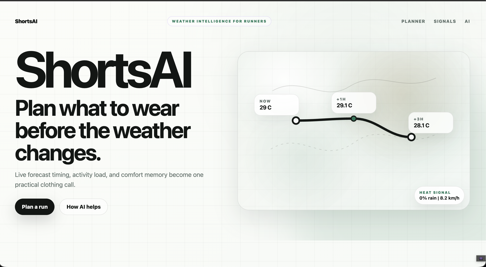
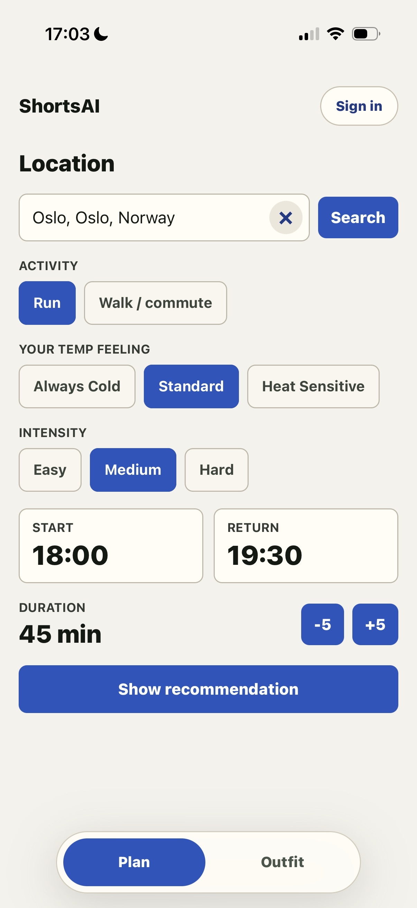
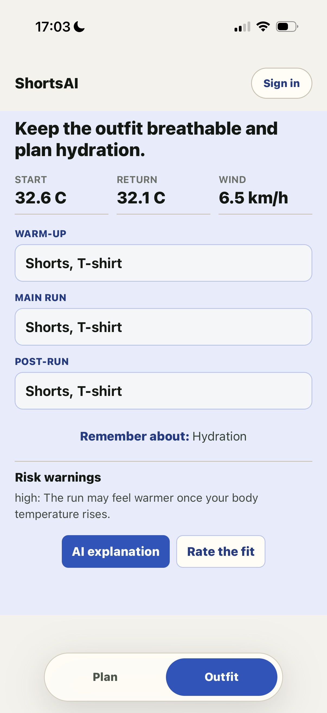
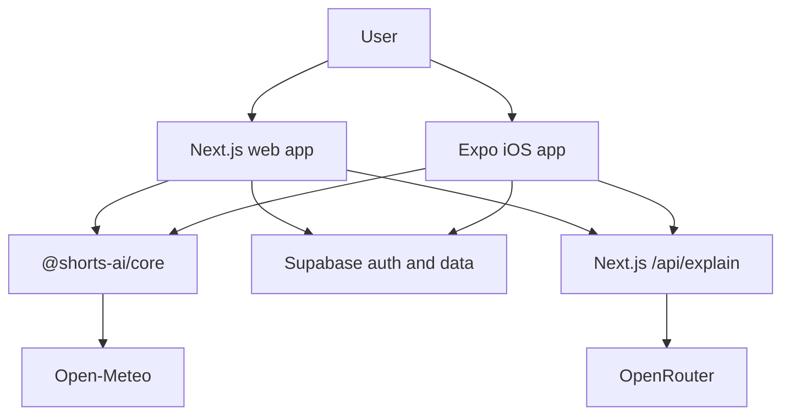

# ShortsAI

ShortsAI is a weather-aware outfit planner for runners, walkers, and everyday outdoor plans. It turns live forecast data, activity timing, return-home conditions, and personal comfort feedback into a clear clothing recommendation.

The app is built around one rule: the recommendation engine decides the outfit, and AI only explains the already locked result.

## Product

ShortsAI helps answer a practical question: what should I wear for this specific plan?

The planner combines:

- location search and hourly Open-Meteo forecast data
- activity mode: run, walk, or commute
- start time, duration, and return time
- running intensity when relevant
- personal temperature feeling and saved feedback
- risk signals such as rain, wind, cold return, heat, and low visibility

The result is an outfit recommendation with confidence, weather context, warnings, reminders, and an optional AI explanation.

## Experience

The first mobile beta follows a staged flow:

1. Plan the activity window.
2. Review the outfit recommendation.
3. Ask for an AI explanation if needed.
4. Save feedback to improve the comfort profile.
5. Manage account, saved locations, and history from the profile area.

The web app remains the public host and API surface. The iOS app uses the same domain logic through a shared TypeScript package.

## Live Demo

Public beta: [https://shorts-ai-theta.vercel.app](https://shorts-ai-theta.vercel.app)

## Screenshots

### Web



### Mobile

<p>
  
  
</p>

## Beta Status

What works in the current beta:

- public Next.js web app, landing page, planner surface, and `/api/explain` endpoint
- Expo iOS beta flow for location search, activity timing, return-home planning, temperature feeling, and running intensity
- deterministic outfit recommendations with warm-up, main run, and post-run phases where relevant
- weather risk signals, reminders, confidence, and fallback explanations
- Supabase-backed sign-in, favourite locations, saved recommendations, feedback, and comfort memory when persistence is configured
- optional AI explanation layer that explains the locked recommendation without changing outfit items

What the beta does not support yet:

- trained machine-learning personalization; feedback currently adjusts deterministic comfort rules
- multi-location comparison, travel-mode planning, or calendar/wearable integrations
- offline mode or guaranteed handling of sudden weather changes outside the forecast data
- App Store distribution, Android packaging, or production push notifications
- AI-generated outfit decisions; AI is scoped to explanations only

## Architecture



## Recommendation Model

The core recommendation flow is deterministic:

- weather and activity inputs are normalized into domain types
- the engine selects clothing items and running phases
- risk warnings and confidence are calculated from structured conditions
- feedback adjusts the comfort offset over time
- fallback explanations are generated without calling an AI model

The AI explanation layer receives the structured recommendation and explains why it was selected. It is scoped to the current plan and is not allowed to change clothing items.

## Codebase

- `app` contains the Next.js web app and API route handlers.
- `features` contains the existing web-facing recommendation UI and adapters.
- `packages/core` contains shared domain types, planner helpers, weather mapping, feedback logic, recommendation rules, and explanation guardrails.
- `apps/mobile` contains the Expo iOS beta app.
- `tests` covers the recommendation engine, explanation guardrails, planner helpers, and feedback projections.

## Setup

Install dependencies from the repository root:

```bash
npm install
```

Create local environment files from the examples:

```bash
cp .env.example .env.local
cp apps/mobile/.env.example apps/mobile/.env
```

Run the web app:

```bash
npm run dev
```

Run the Expo app:

```bash
npm run mobile:start
```

For Expo Go, `EXPO_PUBLIC_API_BASE_URL` should point at a reachable Next.js deployment or local tunnel that serves `/api/explain`.

## Environment Variables

Root web environment:

| Variable | Visibility | Purpose |
| --- | --- | --- |
| `NEXT_PUBLIC_SUPABASE_URL` | Public browser value | Supabase project URL used by the web client. |
| `NEXT_PUBLIC_SUPABASE_ANON_KEY` | Public browser value | Supabase anon key for browser auth and user-scoped data access. |
| `OPENROUTER_API_KEY` | Server-only secret | OpenRouter API key used only by `app/api/explain`. |
| `OPENROUTER_MODEL` | Server-only config | Optional OpenRouter model override. |
| `SUPABASE_SERVICE_ROLE_KEY` | Server-only secret | Service role key used by server-side rate-limit persistence. |
| `RATE_LIMIT_HASH_SECRET` | Server-only secret | HMAC salt for hashing client rate-limit keys. |
| `REQUIRE_PERSISTENT_RATE_LIMIT` | Server-only config | Optional local/dev switch to require the Supabase RPC limiter; production requires it automatically. |

Mobile Expo environment:

| Variable | Visibility | Purpose |
| --- | --- | --- |
| `EXPO_PUBLIC_SUPABASE_URL` | Public app value | Supabase project URL used by the mobile app. |
| `EXPO_PUBLIC_SUPABASE_ANON_KEY` | Public app value | Supabase anon key for mobile auth and user-scoped data access. |
| `EXPO_PUBLIC_API_BASE_URL` | Public app value | Base URL of the Next.js API used for AI explanations. |

Never put `OPENROUTER_API_KEY`, `SUPABASE_SERVICE_ROLE_KEY`, or `RATE_LIMIT_HASH_SECRET` in `NEXT_PUBLIC_*` or `EXPO_PUBLIC_*` variables.

In production, `/api/explain` requires `RATE_LIMIT_HASH_SECRET`, `NEXT_PUBLIC_SUPABASE_URL`,
`SUPABASE_SERVICE_ROLE_KEY`, and the `consume_ai_rate_limit` Supabase RPC. If persistent rate
limiting is unavailable, the route returns a 503 fallback response and does not call OpenRouter.
Placeholder values such as `your-*` are treated as missing configuration.

## Development Checks

Run the full project check before shipping changes:

```bash
npm run check
```

This runs lint, unit tests, the Next.js production build, and the mobile TypeScript check. Individual commands are also available:

```bash
npm run lint
npm test
npm run build
npm run mobile:typecheck
```

## Data

ShortsAI uses Supabase for magic-link authentication and profile persistence. The beta keeps the existing schema for:

- profiles and comfort memory
- favourite locations
- saved recommendations
- feedback ratings

OpenRouter keys stay server-side behind the existing Next.js explanation endpoint. They are not shipped in the mobile app.

## Secret Handling

Local `.env`, `.env.*`, and mobile `.env` files are ignored by Git. Keep real values in local env files, Vercel environment variables, Expo/EAS secrets, or another secret manager. Commit only placeholder examples.

The Supabase anon key is intentionally public and must still rely on Row Level Security. The Supabase service role key is never safe in browser or mobile bundles.

`supabase/schema.sql` is treated as a local generated schema dump and is ignored. Commit durable database changes as SQL files under `supabase/migrations/`.

## Third-Party Data Flows

- Open-Meteo receives location and forecast requests used to build weather snapshots.
- Supabase stores authentication identifiers, profile settings, favourite locations, saved recommendations, and feedback when persistence is enabled.
- OpenRouter receives only structured weather, activity, profile, recommendation facts, and the current explanation question through the server-side `/api/explain` route.
- Vercel Speed Insights collects web performance telemetry for the public web app.
- `/api/explain` rate limiting derives a client key from forwarded IP headers, stores only an HMAC hash of that key, and records counts and reset times. Lightweight server logs contain event names, not prompts or secrets.

## Scope

ShortsAI is currently a beta product with deterministic personalization. It does not include a trained machine-learning model yet. The feedback loop is designed so future versions can evaluate or train a real comfort model once enough ratings exist.

The current scope excludes multi-location comparison and travel-mode planning.

## License

This project is proprietary. See [LICENSE](./LICENSE).
